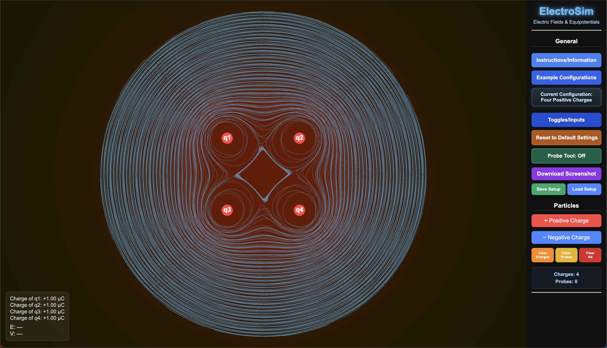
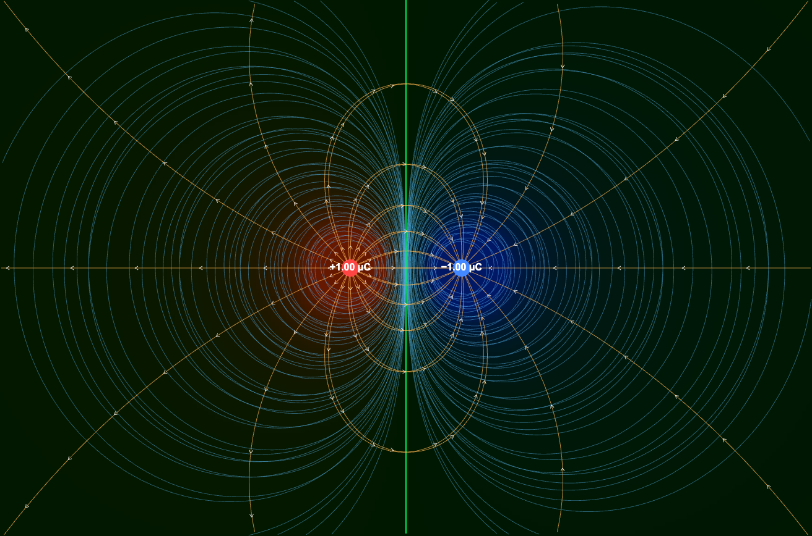
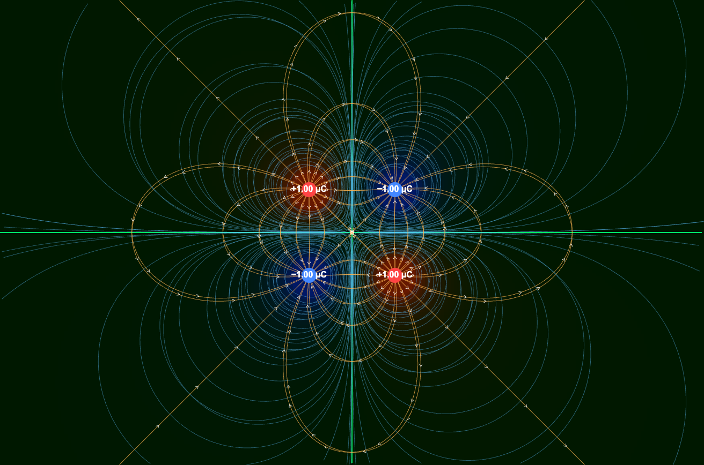

# ElectroSim

An interactive electric fields and equipotential simulator for physics education built with HTML, JavaScript, and CSS.

## Live Demo
**Try ElectroSim in your browser:**
[Launch ElectroSim](https://ad309x.github.io/electrosim/)

## Overview
ElectroSim is a browser-based educational physics simulator designed to help users visualize electric fields and equipotential lines created by positive and negative point charges. The simulator allows users to place charges, explore field behavior, analyze equipotential contours, and interactively investigate electrostatics. No installation is required; everything runs directly in the browser.

## Features
- Interactive positive and negative charge placement
- Electric field visualization
- Equipotential line generation
- Measurement probe tool
- Example charge configurations
- Save and load configurations
- Screenshot export
- Customizable display settings
- Browser-based (no installation required)

## Screenshots

### Four Positive Charges
Symmetry and superposition effects from multiple positive charges.

### Electric Dipole
Classic dipole field structure showing electric field and potential behavior.

### Quadrupole Configuration
More complex field interactions generated by four charges.

## Physics Concepts
ElectroSim helps users explore:
- Coulomb's Law
- Electric Fields
- Electric Potential
- Equipotential Lines
- Superposition of Charges
- Electric Field Direction and Magnitude

## How to Use
1. Open the simulator.
2. Add positive or negative charges.
3. Move charges to create different configurations.
4. Enable electric field lines and equipotential contours.
5. Use the measurement probe to inspect field properties.
6. Explore built-in example scenarios.

## Why I Built This
ElectroSim began as a project inspired by concepts from my AP Physics C: Electricity & Magnetism class. I wanted to create an interactive tool that makes electrostatics more intuitive than traditional textbook diagrams. By allowing users to experiment with charge configurations and immediately observe electric fields and equipotential lines, ElectroSim provides a hands-on way to explore fundamental concepts in electromagnetism.

## Technologies Used
- HTML
- CSS
- JavaScript
- GitHub Pages
- Google Analytics

## Future Improvements
- Additional charge distributions
- Electric dipole and multipole presets
- Field vector visualization improvements
- Improved mobile support
- Additional educational examples
- Performance optimizations
- Magnetic field simulation support
- Educational lesson modules
- Classroom activity presets

## License
This project is licensed under the MIT License.

## Author
Developed by ad309x (Aarush Dutta)
Feedback and suggestions are welcome!
